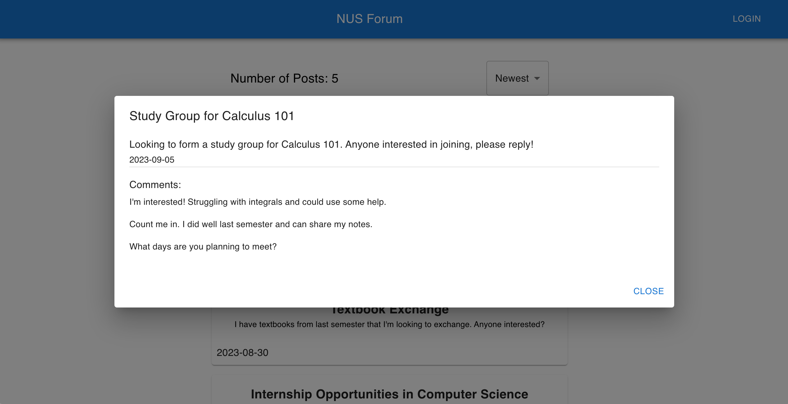
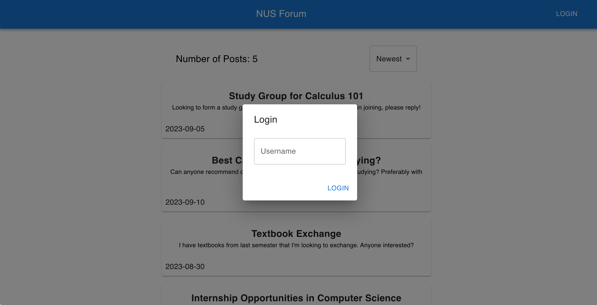

# Forum Frontend

This project is a ReactJS-based frontend for a forum application, styled with Material-UI. It provides a sleek, responsive user interface for forum interactions, including posts, and comments.

ChatGPT was used to create boilerplate, write portions of this README, to debug, and to get the names of types.




## Prerequisites

Before you begin, ensure you have the following installed:
- [Node.js](https://nodejs.org/en/) (version 12.0.0 or later)
- [npm](https://www.npmjs.com/) (typically comes with Node.js)

## Installation

To set up the project locally, follow these steps:

1. **Clone the Repository**
   ```bash
   git clone https://github.com/xk1234/forumfrontend.git
   cd forumfrontend
    ```
2. **Install Dependencies**
   ```bash
   npm install
    ```
3. **Start the project**
   ```bash
    npm start
    ```
4. Setup the backend: https://github.com/xk1234/forumbackend.git


## Usage
Note: The frontend has no loading animations and Render takes some time to spin up the backend after it has been idle for a while, so if you are using the deployed version please wait a little the first time you try it out.


When logged out, you can view all the posts and comments and sort them as well, but cannot post. To change this, you can sign up for a new account using a username as long as it has not been taken.

After logging in, you will be able to see your posts, which will be highlighted in yellow. Most posts show a preview on the front page, but will expand when you click on it. If logged in, you will be able to submit a comment.

If the post is your's, you can edit the contents of the post and even delete it, and the same goes for any comments.

After signing in, you can remain signed in even if you leave the page, since a jwt will be stored in localStorage, but you can logout as well by clicking the logout button.